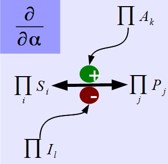

# ADGenKinetics

Modeling biochemical reaction networks with generalized kinetic formats with capabilities for computing parameter sensitivities using algorithmic differentiation techniques

## Library description

A Modelica library for descriptive modeling of biochemical reaction networks using a specific subset of enzyme kinetics referred to as simplified kinetics formats, e.g. convenience kinetics. These subsets of enzyme kinetics are represented by generalized structured kinetic formulas suitable for biochemical reactions with arbitrary number of substrates, products, inhibitors and activators. By utilizing the power of Modelica constructs for providing a compact implementation of such generalized structured formulas is presented.

`ADGenKinetics` is the first algorithmically differentiated library by which algorithmic differentiation (AD) techniques are directly applied at the library level. The resulting additional subpackage contains extended components with which parameter sensitivities, i.e. derivatives of model variables w.r.t. model parameters, are represented. By importing these types in base models, the dynamics of the underlying biochemical reaction network together with the parameter sensitivities, i.e. the derivatives of all variables w.r.t. the specified input parameters, are simulated.

## Current release

Download [ADGenKinetics v1.0+r23 (2012-08-27)](../../archive/v1.0+r23.zip)

#### Release notes

* [Version v1.0+r23 (2012-08-27)](../../archive/v1.0+r23.zip)
 * Initial version.

## License

This Modelica package is free software and the use is completely at your own risk;
it can be redistributed and/or modified under the terms of the [Modelica License 2](https://modelica.org/licenses/ModelicaLicense2).

## Development and contribution
Main developer: [Atiyah Elsheikh](mailto:Atiyah.Elsheikh@ait.ac.at)

You may report any issues with using the [Issues](../../issues) button.

Contributions in shape of [Pull Requests](../../pulls) are always welcome.
